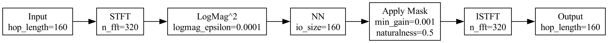
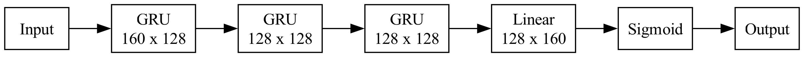

# JumpML Rocketship
A C and Python inference library for speech and audio. 

## Introduction
C and Python code for  
- Neural Network model inference  
  - [x] Linear, GRU layers with 8-bit weights and biases  
  - [x] Float32 and fixed-point 16-bit activations  
  - [x] Converts PyTorch model file (pth) to C   
- DSP Pre/postprocessing  
  - [x] STFT / ISTFT based on the awesome kissFFT library  
  - [x] Log Power Spectrum, Spectral Masking and Gain post-processing  
- Free (Apache 2.0) pretrained weights  
  - [x] ML/AI Noise Reduction: 330kB, 700kB, 2MB (no lookahead)

Intended for applications at the Edge, typically battery-powered, where Privacy, Availability/Reliability, Low Cost (Energy or Fees), Real-Time and very Low Latency are critical.  

### Pretrained Models 

All weights are quantized to 8-bits and we use bytes to report size.

| Model Name/size|  Hop length       |
|----------------|-------------------|
| 330 kB         | 10 ms             |
| 700 kB         | 8 ms              |
| 2 MB           | 8 ms              |

Larger models usually result in improved task performance and quality. 

## Directory Structure
The library follows the following directory structure:

- `build/`: Build artifacts and compiled binaries.
- `data/`: Data files, including sample audio 
- `docs/`: Documentation for JumpML Rocketship.
- `include/`: Header files for C components.
- `models/`: Contains scripts for model conversion, generation, and pre-trained models.
  - `convert_model.py`: Script to convert models to C 
  - `convert_ptj_to_onnx.py`: Script to convert models from JumpML's proprietary format (ptj) to ONNX.
  - `gen_tanh_table.py`: Script to generate a tangent hyperbolic (tanh) table.
  - `model/`: Pytorch models defining audio processing models
  - `pretrained_models/`: Pre-trained models in both ONNX and ptj formats.
  - `run_prediction.py`: Script to run predictions in PyTorch using the trained models.
  - `utils/`: Utility scripts.
- `requirements.txt`: List of Python dependencies for JumpML Rocketship.
- `scripts/`: Miscellaneous scripts.
- `src/`: C source code 
- `test/`: Test cases and examples for the library.
- `third-party/`: Third-party components and dependencies.
  - `kissFFT/`: KissFFT library.


## Getting Started

To get started with JumpML Rocketship, follow these steps:

1. Clone the repository:
   ```bash
   git clone https://github.com/jumpml/rocketship.git
   cd rocketship
   ```

2. Please create a Python virtual environment and install the packages in requirements.txt:  
   ```bash
   pip install requirements.txt  
   ```

3. Build the library using Cmake:  
   ```bash
   cd build  
   cmake ..  
   make  
   ```
4. Run JumpML NR Inference/Prediction script (Pytorch + Librosa/Numpy)  
To run the reference algorithm (preprocessing + NN inference + postprocessing) on an input wav file, please run  
```bash
python models/run_prediction.py -m models/pretrained_models/jumpmlnr_pro.ptj -i data/outdoor_mix.wav -o data/output.wav
```

## JumpML NR 
The JumpML NR block diagram is



The Neural Network architecture is  




### Processing steps  
1. The 16 kHz input signal is framed into Hop Length samples
2. A hanning windowed FFT with 50% overlap is performed 
3. Log Magnitude (Power) features are computed ignoring the Nyquist bin for a total of IO size == Hop Length
4. These IO size features are input to the Neural network and predicts a IO size point mask that multiplies the noisy input spectrum
5. Inverse STFT (Overlap Add) is performed to produce the denoised and speech enhanced output frame

### Denoise Audio Wavefile on MacOS
####  denoise.sh
The denoise.sh script(in the "scripts" directory) calls the testnr executable (in the "build" directory after running "make") which is compiled for MacOS and performs processing at 16 kHz. 

We recommend using denoise.sh to apply JumpML NR on a noisy input file. The shell script takes care of any resampling and file format conversions.

**Usage:**

```bash
scripts/denoise.sh input.wav output.wav naturalness min_gain
```

**Arguments:**

* `input.wav`: input WAV file.
* `output.wav`:  output WAV file.
* `naturalness`: float number between 0 (max suppression) and 1 (most natural). 
* `min_gain`: minimum suppression gain floor in dB in [-60, 0] dB.

**Example tunings to try:**  

Tuning is usually a matter of preference and use case. Any of the below example commands are pretty good starting points:

```bash
scripts/denoise.sh data/outdoor_mix.wav output_nat100_mg40.wav 1 -40  
scripts/denoise.sh data/outdoor_mix.wav output_nat50_mg25.wav 0.5 -25
scripts/denoise.sh data/outdoor_mix.wav output_nat0_mg10.wav 0 -10
```

#### Pre-requisites
Please install SoX 
```bash
brew install sox
```
**Settings in MacOS:**
```bash
chmod +x testnr 
chmod +x denoise.sh
```

Even after this, there may be a popup that says App cannot be run. Please follow the instructions in [this Apple Support article](https://support.apple.com/en-us/HT202491) under  

> If you want to open an app that hasn’t been notarized or is from an unidentified developer
section of the article.

# Acknowledgements
We extend our gratitude to the open-source community, in particular  
- **kissFFT**: [GitHub - kissfft](https://github.com/mborgerding/kissfft): used for FFTs  
- **RNNoise**: [GitHub - RNNoise](https://github.com/xiph/rnnoise): their simple C-based NN inference approach is similar  
- **IRM-based Speech Enhancement using LSTM**: [GitHub - LSTM SE](https://github.com/haoxiangsnr/IRM-based-Speech-Enhancement-using-LSTM) a very good starting point for training models  

# Contributions
Contributions to JumpML Rocketship are welcome and are covered by the Apache License. Feel free to submit pull requests, report issues, or participate in the development process.

(C) 2024  JUMPML. All rights reserved.